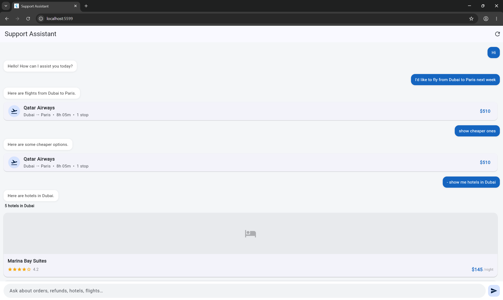
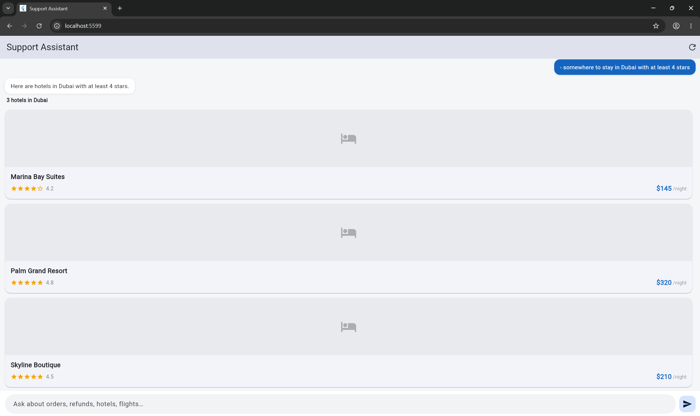
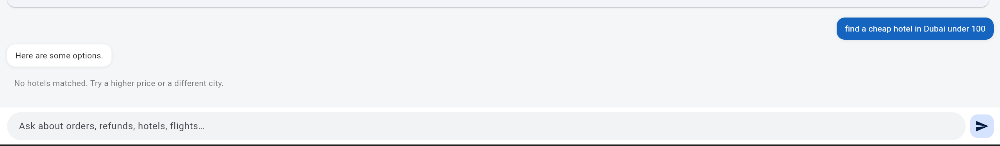

# Offline AI Support Assistant

A fully offline customer-support assistant. A FastAPI backend uses a local Ollama
model to classify the user's intent and extract parameters, runs a matching mock
tool, keeps short-term conversation memory, and returns strict JSON. A Flutter
client reads the `ui_type` field and renders the right widget for each response.

No cloud APIs are involved. After the one-time model pull the whole thing runs
without internet.

## How it works

1. The Flutter app sends `POST /chat` with the message and a `conversation_id`.
2. The backend builds a prompt (system + few-shot + recent history) and asks
   Ollama for a JSON object: an intent plus extracted parameters.
3. The intent maps to a mock tool, which returns static data. Memory is updated.
4. The response comes back as typed JSON with a `ui_type`.
5. The client switches on `ui_type` and renders a hotel list, order tracker,
   info card, or plain text.

If Ollama is unreachable or returns something invalid, a rule-based keyword
classifier takes over so the endpoint always responds with valid JSON.

## Project layout

```
backend/app/
  main.py      routes (/chat, /health, ...)
  schemas.py   typed API contract
  config.py    settings
  memory.py    short-term conversation memory
  llm/         Ollama client + prompts
  services/    intent classification + chat orchestration
  tools/       six mock tools + registry
frontend/lib/
  models/ services/ state/ widgets/
screenshots/   README images
```

## Prerequisites

- [Ollama](https://ollama.com) running locally
- Python 3.12+
- Flutter 3.x

## Run the backend

```bash
# 1. pull a model once 
ollama pull llama3.1

# 2. install and run
cd backend
python -m venv .venv
.venv\Scripts\activate         
pip install -r requirements.txt
uvicorn app.main:app --reload
```

The API is now at `http://localhost:8000`. Settings can be overridden with
environment variables (or a `.env` file — see `backend/.env.example`):

```
APP_OLLAMA_BASE_URL=http://localhost:11434
APP_OLLAMA_MODEL=llama3.1
APP_MAX_HISTORY_TURNS=5
```

Run the tests (these mock Ollama, so they pass without a model):

```bash
cd backend
pytest
```

## Run the frontend

Only `lib/` is committed, so generate the platform folders first:

```bash
cd frontend
flutter create .        # creates android/ ios/ web/ etc.
flutter pub get
flutter run             # or: flutter run -d chrome
```

The backend URL defaults to `http://localhost:8000`. On an Android emulator the
host is reached through `10.0.2.2`, so run:

```bash
flutter run --dart-define=API_BASE_URL=http://10.0.2.2:8000
```

## Run everything with Docker

```bash
docker compose up -d
docker compose exec ollama ollama pull llama3.1   # one time
```

Backend on `:8000`, Ollama on `:11434`.

## API

`POST /chat`

```bash
curl -X POST http://localhost:8000/chat \
  -H "Content-Type: application/json" \
  -d '{"message": "show me hotels in Dubai under 200"}'
```

```json
{
  "conversation_id": "93b824b8-...",
  "intent": "hotel_search",
  "ui_type": "hotel_list",
  "message": "Here are hotels in Dubai under 200.",
  "data": {
    "location": "Dubai",
    "count": 3,
    "hotels": [
      {"id": "h1", "name": "Marina Bay Suites", "location": "Dubai", "price": 145, "rating": 4.2, "image": "..."}
    ]
  },
  "tool": "hotel_tool",
  "used_fallback": false
}
```

Follow-ups reuse the previous search context. Send the next message with the same
`conversation_id`:

```bash
curl -X POST http://localhost:8000/chat \
  -H "Content-Type: application/json" \
  -d '{"message": "show cheaper ones", "conversation_id": "93b824b8-..."}'
```

The server remembers the last hotel search, so "cheaper ones" keeps `location`
and just applies `sort=price_asc`.

Other endpoints:

- `POST /reset?conversation_id=...` — clear a conversation's memory.
- `GET /health` — liveness and whether Ollama is reachable.

## Design notes

- Every response is a Pydantic
  `ChatResponse`, and intents map to `ui_type` through a single table
  (`INTENT_TO_UI`). The client never parses loose maps.
- **Deterministic routing.** The model is asked for structured output via
  Ollama's `format` JSON schema at `temperature=0`, then validated with Pydantic.
  Intents map to tools through a registry, so adding a new capability is a tool
  function plus two table entries.
- **Always responds.** A keyword classifier backs up the LLM, so an outage or a
  bad model response still produces a valid, typed answer.
- **Short-term memory.** A per-conversation store keeps the last few turns and
  the most recent search parameters, which is what makes follow-ups work.
- **Extensible UI.** `WidgetFactory` switches on `ui_type`; a new screen is one
  more `case`.

## Offline note

The mock hotel data uses remote placeholder image URLs. With no internet the
images simply fall back to a local icon, but everything else works offline.

## Screenshots

The Flutter web client talking to the local backend.

Greeting, a flight search, a "show cheaper ones" follow-up, then a hotel search —
each answer rendered as its own widget:



Hotel results with star ratings and prices; the model picked up "at least 4 stars"
straight from the sentence:



The empty state, shown when nothing matches the filters:


